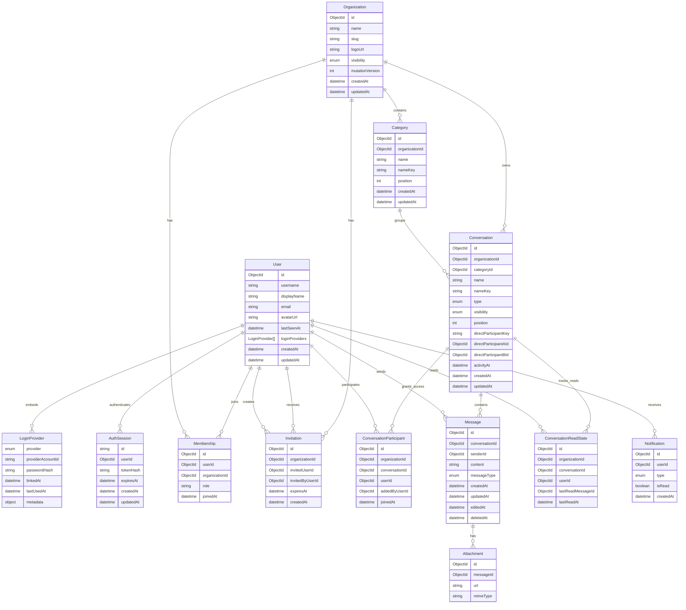

  

`LoginProvider.providerAccountId` stores the Google `sub` for Google identities.

The pair of `provider` and `providerAccountId` is uniquely indexed across users.

New users/provider links and their initial `AuthSession` are committed in one

MongoDB transaction.

  

Organization ownership is represented only by an `OWNER` membership. The

organization document does not duplicate ownership with an `ownerId` field.

Memberships are unique by `(organizationId, userId)`, and a partial unique index

on `(organizationId, role)` permits at most one `OWNER` membership per

organization. Organization creation and deletion maintain the required owner

membership in the same MongoDB transaction.

  

`Organization.mutationVersion` is internal and is incremented inside

organization-scoped write transactions. Concurrent mutations therefore contend

on one organization document, allowing MongoDB's transaction retry behavior to

serialize ordering and lifecycle changes without exposing the version publicly

or changing `updatedAt`.

  

Invitation documents represent pending invitations only. They are unique by

`(organizationId, invitedUserId)`, expire after seven days, and are deleted when

accepted, declined, or when the organization is deleted.

  

Category names are case-insensitively unique within an organization through the

internal `nameKey`. Channel conversations require a category, use

`type = CHANNEL`, and have case-insensitively unique names within that category.

Both categories and channels use zero-based positions.

  

Direct messages use the same `Conversation` collection with `type = DIRECT`.

Their category, name, name key, visibility, and position fields are absent. A

sorted internal `directParticipantKey` and a partial unique index enforce one DM

per user pair in each organization. Exactly two participant records grant DM

access, in addition to both users requiring current organization membership.

The sorted `directParticipantAId` and `directParticipantBId` fields plus

`activityAt` support participant-specific, database-bounded DM pagination.

Message creation advances `activityAt` in the same transaction as the message.

  

Public channels inherit organization membership. Private channels require both

an organization membership and a unique `(conversationId, userId)` participant

record. The organization owner is the initial participant in a private channel.

Participant records are removed when a channel becomes public.

  

`ConversationReadState` is the durable high-water mark for a user's reads in a

conversation. It is unique by `(conversationId, userId)`. Unread counts exclude

the reader's own and deleted messages after `lastReadMessageId`. Organization

and conversation deletion remove read states in the same transaction.

  

Online presence and typing are runtime-only state. `User.lastSeenAt` is the only

persisted presence field and is updated after the user's final socket has been

offline for the disconnect grace period.

  

Deleted messages remain as redacted timeline tombstones: `content` is nullable

only when `deletedAt` is set. Messages and conversation participants are removed

transactionally when their channel or organization is deleted.