```mermaid
erDiagram

    User {
        ObjectId id
        string username
        string displayName
        string email
        string avatarUrl
        ObjectId avatarAssetId
        enum emailVerificationStatus
        datetime emailVerifiedAt
        datetime lastSeenAt
        LoginProvider[] loginProviders
        datetime createdAt
        datetime updatedAt
    }

    LoginProvider {
        enum provider
        string providerAccountId
        string passwordHash
        datetime linkedAt
        datetime lastUsedAt
        object metadata
    }

    AuthSession {
        string id
        ObjectId userId
        string tokenHash
        datetime expiresAt
        datetime createdAt
        datetime updatedAt
    }

    AuthActionToken {
        string id
        ObjectId userId
        enum purpose
        string secretHash
        datetime expiresAt
        datetime createdAt
    }

    MailOutbox {
        ObjectId id
        string aggregateKey
        enum kind
        string ciphertext
        string iv
        string authTag
        enum status
        int attempts
        datetime availableAt
        datetime dispatchedAt
        datetime leaseUntil
        datetime expiresAt
        datetime sentAt
        datetime purgeAt
        datetime createdAt
        datetime updatedAt
    }

    Organization {
        ObjectId id
        string name
        string slug
        ObjectId logoAssetId
        enum visibility
        int mutationVersion
        datetime createdAt
        datetime updatedAt
    }

    Membership {
        ObjectId id
        ObjectId userId
        ObjectId organizationId
        string role
        datetime joinedAt
    }

    Invitation {
        ObjectId id
        ObjectId organizationId
        ObjectId invitedUserId
        ObjectId invitedByUserId
        datetime expiresAt
        datetime createdAt
    }

    Category {
        ObjectId id
        ObjectId organizationId
        string name
        string nameKey
        int position
        datetime createdAt
        datetime updatedAt
    }

    Conversation {
        ObjectId id
        ObjectId organizationId
        ObjectId categoryId
        string name
        string nameKey
        enum type
        enum kind
        string voiceRoomId
        enum visibility
        int position
        string directParticipantKey
        ObjectId directParticipantAId
        ObjectId directParticipantBId
        datetime activityAt
        datetime createdAt
        datetime updatedAt
    }

    ConversationParticipant {
        ObjectId id
        ObjectId organizationId
        ObjectId conversationId
        ObjectId userId
        ObjectId addedByUserId
        datetime joinedAt
    }

    Message {
        ObjectId id
        ObjectId conversationId
        ObjectId senderId
        string content
        enum messageType
        ObjectId callId
        ObjectId replyToMessageId
        json mentions
        ObjectId notifiedMentionUserIds
        datetime createdAt
        datetime updatedAt
        datetime editedAt
        datetime deletedAt
    }

    MessageReaction {
        ObjectId id
        ObjectId conversationId
        ObjectId messageId
        ObjectId userId
        string emoji
        datetime createdAt
        datetime updatedAt
    }

    CallSession {
        ObjectId id
        ObjectId organizationId
        ObjectId conversationId
        ObjectId callerUserId
        ObjectId recipientUserId
        enum mediaMode
        string providerRoomId
        ObjectId timelineMessageId
        enum status
        enum endReason
        datetime startedAt
        datetime acceptedAt
        datetime answeredAt
        datetime endedAt
        datetime createdAt
        datetime updatedAt
    }

    ConversationReadState {
        ObjectId id
        ObjectId organizationId
        ObjectId conversationId
        ObjectId userId
        ObjectId lastReadMessageId
        datetime lastReadAt
    }

    ChatWallpaperPreference {
        ObjectId id
        ObjectId userId
        ObjectId conversationId
        enum wallpaperId
        int dimming
        datetime createdAt
        datetime updatedAt
    }

    StoredAsset {
        ObjectId id
        ObjectId ownerUserId
        ObjectId organizationId
        ObjectId conversationId
        ObjectId messageId
        enum purpose
        enum status
        string stagingKey
        string objectKey
        string fileName
        string declaredContentType
        int declaredSize
        string verifiedContentType
        int verifiedSize
        enum kind
        string etag
        datetime expiresAt
        datetime promotionLeaseUntil
        datetime cleanupLeaseUntil
        int cleanupAttempts
        datetime cleanupAvailableAt
        datetime createdAt
        datetime updatedAt
    }

    UploadDailyUsage {
        ObjectId id
        ObjectId userId
        string dayKey
        int bytes
        datetime expiresAt
    }

    Notification {
        ObjectId id
        ObjectId recipientUserId
        ObjectId actorUserId
        ObjectId organizationId
        enum type
        ObjectId invitationId
        ObjectId conversationId
        enum conversationType
        ObjectId messageId
        ObjectId latestMessageId
        string emoji
        int messageCount
        string dedupeKey
        string activeGroupKey
        datetime readAt
        int pushVersion
        int pushEnqueuedVersion
        datetime lastActivityAt
        datetime expiresAt
        datetime createdAt
        datetime updatedAt
    }

    NotificationPreference {
        ObjectId id
        ObjectId userId
        json categories
        datetime createdAt
        datetime updatedAt
    }

    NotificationMute {
        ObjectId id
        ObjectId userId
        ObjectId organizationId
        ObjectId conversationId
        datetime mutedUntil
        datetime createdAt
        datetime updatedAt
    }

    PushDevice {
        ObjectId id
        ObjectId userId
        string installationId
        enum platform
        string tokenHash
        string ciphertext
        string iv
        string authTag
        boolean enabled
        datetime lastRegisteredAt
        datetime invalidatedAt
        datetime purgeAt
    }

    PushOutbox {
        ObjectId id
        ObjectId notificationId
        ObjectId recipientUserId
        int pushVersion
        enum status
        int attempts
        int receiptAttempts
        datetime availableAt
        datetime receiptAvailableAt
        datetime expiresAt
        datetime purgeAt
    }

    CallAlertOutbox {
        ObjectId id
        string callId
        ObjectId recipientUserId
        enum kind
        enum status
        int attempts
        datetime availableAt
        datetime expiresAt
        datetime dispatchedAt
        datetime leaseUntil
        string lastError
        datetime purgeAt
        datetime createdAt
        datetime updatedAt
    }

    User ||--o{ Membership : joins
    User ||--o{ LoginProvider : embeds
    User ||--o{ AuthSession : authenticates
    User ||--o{ AuthActionToken : authorizes_email_action
    Organization ||--o{ Membership : has
    Organization ||--o{ Invitation : has
    User ||--o{ Invitation : receives
    User ||--o{ Invitation : creates

    Organization ||--o{ Category : contains

    Organization ||--o{ Conversation : owns

    Category ||--o{ Conversation : groups

    Conversation ||--o{ ConversationParticipant : grants_access

    User ||--o{ ConversationParticipant : participates

    Conversation ||--o{ Message : contains

    User ||--o{ Message : sends

    Message ||--o{ MessageReaction : receives

    Conversation ||--o{ MessageReaction : scopes

    User ||--o{ MessageReaction : selects

    Conversation ||--o{ ConversationReadState : tracks_reads

    User ||--o{ ConversationReadState : reads

    User ||--o{ ChatWallpaperPreference : customizes

    Conversation ||--o{ ChatWallpaperPreference : overrides

    User ||--o| NotificationPreference : configures

    User ||--o{ NotificationMute : mutes

    Organization ||--o{ NotificationMute : scopes

    Conversation ||--o{ NotificationMute : optionally_scopes

    User ||--o{ StoredAsset : owns

    User o|--o| StoredAsset : uses_avatar

    Organization o|--o| StoredAsset : uses_logo

    Organization ||--o{ StoredAsset : accounts_storage

    Conversation ||--o{ StoredAsset : scopes

    Message ||--o{ StoredAsset : attaches

    Organization ||--o{ CallSession : scopes

    Conversation ||--o{ CallSession : contains

    Message ||--o| CallSession : records

    User ||--o{ CallSession : participates

    User ||--o{ UploadDailyUsage : reserves

    User ||--o{ Notification : receives

    User ||--o{ Notification : acts

    Organization ||--o{ Notification : scopes

    Invitation ||--o| Notification : references

    Conversation ||--o{ Notification : references

    Message ||--o{ Notification : references

    User ||--o{ PushDevice : registers

    User ||--o{ PushOutbox : receives

    Notification ||--o{ PushOutbox : delivers

    CallSession ||--o{ CallAlertOutbox : interrupts

    User ||--o{ CallAlertOutbox : receives
```

`LoginProvider.providerAccountId` stores the Google `sub` for Google identities.
The pair of `provider` and `providerAccountId` is uniquely indexed across users.
Google users/provider links and their initial `AuthSession` are committed in
one MongoDB transaction. Password registration instead commits a pending user,
a single-use verification token, and its encrypted outbox job atomically; it
does not create an authenticated session until the user confirms the email and
logs in.

`AuthActionToken` stores only an HMAC of the opaque token secret. Tokens are
unique per `(userId, purpose)`, expire through a TTL index, and are consumed
atomically. Email-confirmation tokens live for 24 hours; password-reset tokens
live for 15 minutes. Successful password reset also confirms the email and
deletes every refresh session for that user in the same transaction.

`MailOutbox` is the transactional boundary between MongoDB changes and the
configured mail provider.
Sensitive recipient/token payloads are AES-256-GCM encrypted at rest. A unique
aggregate key supersedes pending verification/reset jobs. `dispatchedAt`
supports idempotent BullMQ reconciliation while repository leases, bounded
retries, and TTL cleanup preserve MongoDB as the durable source of truth.
Delivery happens after the surrounding database transaction commits; provider
failure never leaves an orphaned account or invitation mutation.

Organization ownership is represented only by an `OWNER` membership. The
organization document does not duplicate ownership with an `ownerId` field.
Memberships are unique by `(organizationId, userId)`, and a partial unique index
on `(organizationId, role)` permits at most one `OWNER` membership per
organization. Organization creation and deletion maintain the required owner
membership in the same MongoDB transaction.

`Organization.mutationVersion` is internal and is incremented inside
organization-scoped write transactions. Concurrent mutations therefore contend
on one organization document, allowing MongoDB's transaction retry behavior to
serialize ordering and lifecycle changes without exposing the version publicly
or changing `updatedAt`.

Invitation documents represent pending invitations only. They are unique by
`(organizationId, invitedUserId)`, expire after seven days, and are deleted when
accepted, declined, or when the organization is deleted. Creating a pending
invitation queues its email in the same transaction; consuming or deleting the
invitation cancels a still-pending outbox job.

Category names are case-insensitively unique within an organization through the
internal `nameKey`. Channel conversations require a category, use
`type = CHANNEL`, and have case-insensitively unique names within that category.
Both categories and channels use zero-based positions.

Direct messages use the same `Conversation` collection with `type = DIRECT`.
Their category, name, name key, visibility, and position fields are absent. A
sorted internal `directParticipantKey` and a partial unique index enforce one DM
per user pair in each organization. Exactly two participant records grant DM
access, in addition to both users requiring current organization membership.
The sorted `directParticipantAId` and `directParticipantBId` fields plus
`activityAt` support participant-specific, database-bounded DM pagination.
Message creation advances `activityAt` in the same transaction as the message.

Public channels inherit organization membership. Private channels require both
an organization membership and a unique `(conversationId, userId)` participant
record. The organization owner is the initial participant in a private channel.
Participant records are removed when a channel becomes public.

`ConversationReadState` is the durable high-water mark for a user's reads in a
conversation. It is unique by `(conversationId, userId)`. Unread counts exclude
the reader's own and deleted messages after `lastReadMessageId`. Organization
and conversation deletion remove read states in the same transaction. Direct
conversation DTOs expose both the caller's state and the peer's state; channel
reader state remains private and is used for that reader's unread count. The
`(conversationId, lastReadMessageId, lastReadAt)` index supports sender-only
channel reader summaries. Those summaries are derived by joining current
organization memberships and, for private channels, current participants; no
separate receipt-detail collection is stored.

`ChatWallpaperPreference` stores private, per-user presentation preferences.
`conversationId = null` represents the user's default; a conversation ID
represents an override visible only to that user. A unique
`(userId, conversationId)` index permits one preference per scope, and a
conversation cleanup index supports transactional channel and organization
deletion. Preset IDs are platform-neutral shared contracts; image files remain
client assets rather than database content.

Online presence and typing are runtime-only state. `User.lastSeenAt` is the only
persisted presence field and is updated after the user's final socket has been
offline for the disconnect grace period. Production runtime state is held in
Redis with expiring socket leases; no Redis presence or typing keys are part of
the durable MongoDB data model.

Deleted messages remain as redacted timeline tombstones. `content` is also
nullable for attachment messages whose optional caption is absent. Messages and
conversation participants are removed transactionally when their channel or
organization is deleted.

`StoredAsset` is the authoritative metadata record for every private R2 object.
`PENDING` objects use random staging keys; successful signature verification and
an ETag-conditional copy produce immutable final keys and `PROMOTED` records.
Message creation, avatar replacement, and organization-logo assignment claim
promoted assets as `READY` in the same MongoDB transaction as the domain
mutation. Message redaction, conversation deletion, organization deletion,
avatar replacement, and logo replacement mark
claimed assets `DELETE_PENDING`; a leased worker removes staging/final objects
and then deletes their records with bounded retry backoff. BullMQ schedules the
cleanup by opaque asset ID in production; MongoDB leases and attempt counters
remain authoritative and allow polling fallback. Object keys and
presigned URLs never enter public DTOs. Owner/status, organization/status,
message, and cleanup indexes support limits, hydration, and lifecycle work.
`UploadDailyUsage` atomically reserves issued bytes per `(userId, UTC day)` and
expires through a TTL index. Pending and promoted message assets count against
organization storage until claimed or purged.

`MessageReaction` stores one normalized Unicode emoji sequence per user and
message. A unique `(messageId, userId)` index enforces the one-reaction rule;
`(conversationId, messageId, emoji)` and `(messageId, emoji, id)` indexes support
summary aggregation, cleanup, and cursor-paginated reactor lists. Personalized
reaction summaries are derived from current memberships and, for private
channels and direct messages, current participant records. Message redaction,
conversation deletion, organization deletion, private-participant removal, and
public-to-private visibility transitions delete reactions that no longer have a
valid lifecycle or authorized owner.

`Message.replyToMessageId` is immutable and constrained by the service to the
same conversation. Mention records embed the selected user and validated UTF-16
range. Reply previews are bulk hydrated from message and public-user records;
they are not duplicated into the stored message. `notifiedMentionUserIds`
prevents repeated edits and retries from notifying the same recipient twice.

`Notification` stores durable, recipient-specific in-app activity for pending
organization invitations, accepted invitations, incoming direct messages,
channel mentions, channel replies, and reactions to the recipient's messages.
Invitation, mention, reply, and reaction notifications
use deterministic deduplication keys. Consecutive unread direct messages from
the same conversation share an `activeGroupKey`, increment `messageCount`, and
advance `latestMessageId`; advancing the recipient's DM read state closes that
group. Notifications expire through `expiresAt` after 30 days, except pending
invitation notifications, which expire with their seven-day invitation. The
recipient/activity, unread-recipient, unique deduplication, active-group,
lifecycle-cleanup, and TTL indexes support inbox pagination, unread counts,
idempotency, and transactional deletion. Notification creation and cleanup
participate in the source domain transaction; Socket.IO publication occurs only
after commit and carries safe hydrated DTOs to the recipient's user room.

`NotificationPreference` is unique per user and stores the five category
switches. Its absence resolves to all categories enabled. `NotificationMute`
is unique per user and organization/conversation scope; an absent `mutedUntil`
means indefinite and a TTL index removes expired timed mutes. Preferences and
mutes are evaluated immediately before push dispatch, so delayed BullMQ jobs
honor current settings without deleting durable notification records.

`PushDevice` stores one encrypted Expo token per app installation. The token
hash enforces global uniqueness without making the provider token queryable,
and invalid registrations receive a delayed TTL cleanup timestamp.
`PushOutbox` stores only notification/user references, a notification version,
provider ticket IDs, bounded retry state, and receipt timing. BullMQ carries
opaque outbox IDs; MongoDB reconciliation recovers enqueue gaps after crashes.
The final mobile logout request may include its installation ID so session and
push registration are removed together from the user's perspective.

`CallAlertOutbox` stores short-lived direct-call interruption work separately
from the durable notification inbox. The incoming alert is unique per call and
recipient, expires with the 30-second ringing window, and is delivered only
while the call remains `RINGING`. The first terminal or connecting state update
enqueues a data-only cancellation signal so mobile clients can dismiss stale
ringing UI. Delivery checks the calls category and current organization or
conversation mutes immediately before contacting Expo. Repository leases,
bounded retries, reconciliation, and TTL cleanup make MongoDB authoritative;
BullMQ carries only the opaque outbox ID.

Search does not introduce a persistence entity. Native development search uses
text indexes on `Message.content`, `Conversation.name`, and the weighted
`User.displayName`/`User.username` pair. Production uses three versioned Atlas
Search indexes over the same collections. Message results are filtered to
currently accessible conversation IDs before DTO serialization; people results
are filtered to current organization memberships and never expose email or
provider data. Search cursors are opaque and bound to the provider, normalized
query, result type, and optional conversation filter.

Channel conversations have immutable `kind = TEXT | VOICE`. Existing channels
are backfilled to `TEXT`; voice channels own an opaque provider room ID and do
not have message history, unread state, or read receipts. `CallSession` stores
the durable direct-message call lifecycle and links exactly one immutable
`Message.messageType = CALL` timeline entry. Provider room IDs are selected out
of normal queries and never enter public DTOs. `CallSession.mediaMode` records
whether the call began as `AUDIO` or `VIDEO`; current camera state is ephemeral.
Live occupancy, participant
identities, connection leases, and webhook deduplication remain expiring Redis
state rather than MongoDB entities.

`AiOrganizationSettings` stores one optional AI-enablement record per
organization, including the active disclosure version, enabling owner, and
enablement timestamp. `AiUserConsent` is unique by `(organizationId, userId)`
and records acceptance of that same disclosure version. Disabling organization
AI removes member consent records so re-enablement requires fresh consent.
Organization deletion removes both records transactionally. Prompt text,
retrieved excerpts, model output, provider request IDs, and token contents are
never stored. Daily request counters and short concurrency leases are runtime
state in Redis rather than durable MongoDB entities.
