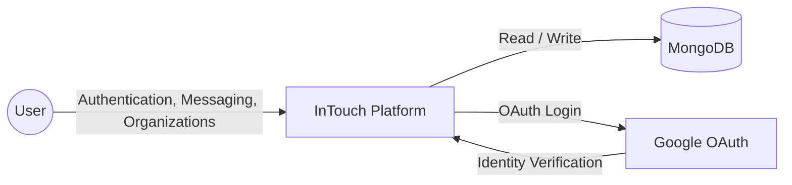

```mermaid
flowchart LR

    User((User))

    InTouch["InTouch Platform"]

    DB[(MongoDB)]

    OAuth[Google OAuth]

    User -->|Authentication, Messaging, Organizations| InTouch

    InTouch -->|Read / Write| DB

    InTouch -->|OAuth Login| OAuth

    OAuth -->|Identity Verification| InTouch
```