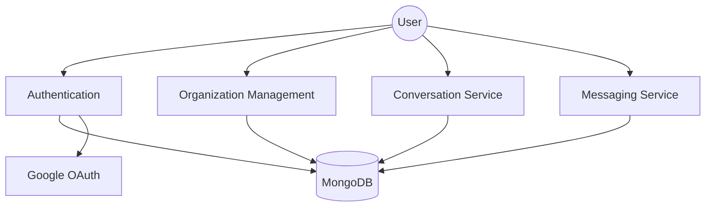

```mermaid
flowchart TD

    User((User))

    Auth[Authentication]

    Org[Organization Management]

    Conversation[Conversation Service]

    Message[Messaging Service]

    Mongo[(MongoDB)]

    Google[Google OAuth]

    User --> Auth

    User --> Org

    User --> Conversation

    User --> Message

    Auth --> Mongo
    Auth --> Google

    Org --> Mongo

    Conversation --> Mongo

    Message --> Mongo
```