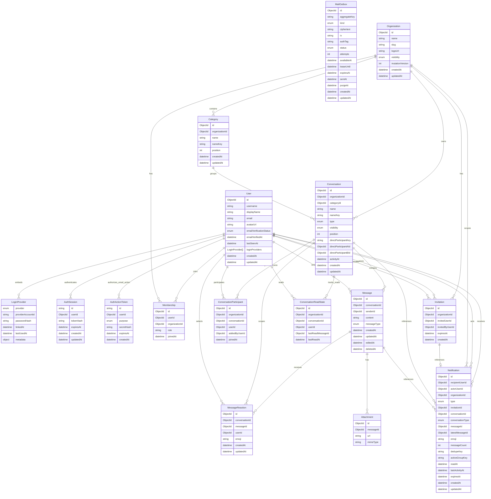

  

`LoginProvider.providerAccountId` stores the Google `sub` for Google identities.

The pair of `provider` and `providerAccountId` is uniquely indexed across users.

Google users/provider links and their initial `AuthSession` are committed in

one MongoDB transaction. Password registration instead commits a pending user,

a single-use verification token, and its encrypted outbox job atomically; it

does not create an authenticated session until the user confirms the email and

logs in.

  

`AuthActionToken` stores only an HMAC of the opaque token secret. Tokens are

unique per `(userId, purpose)`, expire through a TTL index, and are consumed

atomically. Email-confirmation tokens live for 24 hours; password-reset tokens

live for 15 minutes. Successful password reset also confirms the email and

deletes every refresh session for that user in the same transaction.

  

`MailOutbox` is the transactional boundary between MongoDB changes and the

configured mail provider.

Sensitive recipient/token payloads are AES-256-GCM encrypted at rest. A unique

aggregate key supersedes pending verification/reset jobs, while the worker uses

leases, bounded retries, and TTL cleanup. Delivery happens after the surrounding

database transaction commits; provider failure never leaves an orphaned account or

invitation mutation.

  

Organization ownership is represented only by an `OWNER` membership. The

organization document does not duplicate ownership with an `ownerId` field.

Memberships are unique by `(organizationId, userId)`, and a partial unique index

on `(organizationId, role)` permits at most one `OWNER` membership per

organization. Organization creation and deletion maintain the required owner

membership in the same MongoDB transaction.

  

`Organization.mutationVersion` is internal and is incremented inside

organization-scoped write transactions. Concurrent mutations therefore contend

on one organization document, allowing MongoDB's transaction retry behavior to

serialize ordering and lifecycle changes without exposing the version publicly

or changing `updatedAt`.

  

Invitation documents represent pending invitations only. They are unique by

`(organizationId, invitedUserId)`, expire after seven days, and are deleted when

accepted, declined, or when the organization is deleted. Creating a pending

invitation queues its email in the same transaction; consuming or deleting the

invitation cancels a still-pending outbox job.

  

Category names are case-insensitively unique within an organization through the

internal `nameKey`. Channel conversations require a category, use

`type = CHANNEL`, and have case-insensitively unique names within that category.

Both categories and channels use zero-based positions.

  

Direct messages use the same `Conversation` collection with `type = DIRECT`.

Their category, name, name key, visibility, and position fields are absent. A

sorted internal `directParticipantKey` and a partial unique index enforce one DM

per user pair in each organization. Exactly two participant records grant DM

access, in addition to both users requiring current organization membership.

The sorted `directParticipantAId` and `directParticipantBId` fields plus

`activityAt` support participant-specific, database-bounded DM pagination.

Message creation advances `activityAt` in the same transaction as the message.

  

Public channels inherit organization membership. Private channels require both

an organization membership and a unique `(conversationId, userId)` participant

record. The organization owner is the initial participant in a private channel.

Participant records are removed when a channel becomes public.

  

`ConversationReadState` is the durable high-water mark for a user's reads in a

conversation. It is unique by `(conversationId, userId)`. Unread counts exclude

the reader's own and deleted messages after `lastReadMessageId`. Organization

and conversation deletion remove read states in the same transaction. Direct

conversation DTOs expose both the caller's state and the peer's state; channel

reader state remains private and is used for that reader's unread count. The

`(conversationId, lastReadMessageId, lastReadAt)` index supports sender-only

channel reader summaries. Those summaries are derived by joining current

organization memberships and, for private channels, current participants; no

separate receipt-detail collection is stored.

  

Online presence and typing are runtime-only state. `User.lastSeenAt` is the only

persisted presence field and is updated after the user's final socket has been

offline for the disconnect grace period.

  

Deleted messages remain as redacted timeline tombstones: `content` is nullable

only when `deletedAt` is set. Messages and conversation participants are removed

transactionally when their channel or organization is deleted.

  

`MessageReaction` stores one normalized Unicode emoji sequence per user and

message. A unique `(messageId, userId)` index enforces the one-reaction rule;

`(conversationId, messageId, emoji)` and `(messageId, emoji, id)` indexes support

summary aggregation, cleanup, and cursor-paginated reactor lists. Personalized

reaction summaries are derived from current memberships and, for private

channels and direct messages, current participant records. Message redaction,

conversation deletion, organization deletion, private-participant removal, and

public-to-private visibility transitions delete reactions that no longer have a

valid lifecycle or authorized owner.

  

`Notification` stores durable, recipient-specific in-app activity for pending

organization invitations, accepted invitations, incoming direct messages, and

reactions to the recipient's messages. Invitation and reaction notifications

use deterministic deduplication keys. Consecutive unread direct messages from

the same conversation share an `activeGroupKey`, increment `messageCount`, and

advance `latestMessageId`; advancing the recipient's DM read state closes that

group. Notifications expire through `expiresAt` after 30 days, except pending

invitation notifications, which expire with their seven-day invitation. The

recipient/activity, unread-recipient, unique deduplication, active-group,

lifecycle-cleanup, and TTL indexes support inbox pagination, unread counts,

idempotency, and transactional deletion. Notification creation and cleanup

participate in the source domain transaction; Socket.IO publication occurs only

after commit and carries safe hydrated DTOs to the recipient's user room.

  

Search does not introduce a persistence entity. Native development search uses

text indexes on `Message.content`, `Conversation.name`, and the weighted

`User.displayName`/`User.username` pair. Production uses three versioned Atlas

Search indexes over the same collections. Message results are filtered to

currently accessible conversation IDs before DTO serialization; people results

are filtered to current organization memberships and never expose email or

provider data. Search cursors are opaque and bound to the provider, normalized

query, result type, and optional conversation filter.