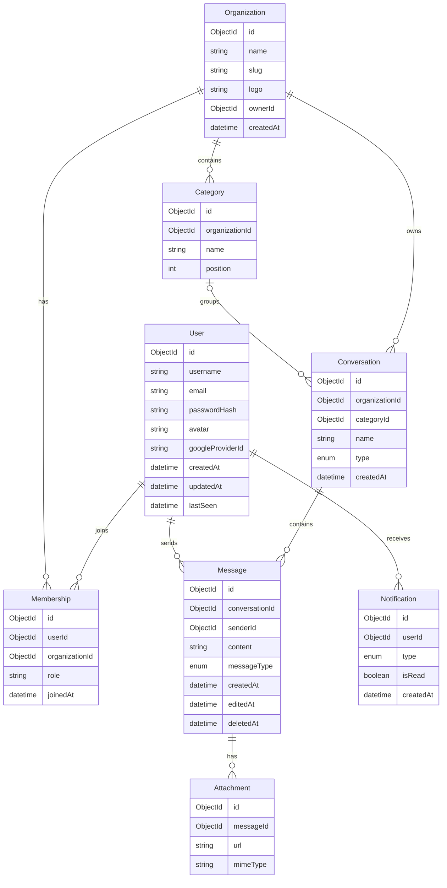

```mermaid
erDiagram

    User {
        ObjectId id
        string username
        string email
        string passwordHash
        string avatar
        string googleProviderId
        datetime createdAt
        datetime updatedAt
        datetime lastSeen
    }

    Organization {
        ObjectId id
        string name
        string slug
        string logo
        ObjectId ownerId
        datetime createdAt
    }

    Membership {
        ObjectId id
        ObjectId userId
        ObjectId organizationId
        string role
        datetime joinedAt
    }

    Category {
        ObjectId id
        ObjectId organizationId
        string name
        int position
    }

    Conversation {
        ObjectId id
        ObjectId organizationId
        ObjectId categoryId
        string name
        enum type
        datetime createdAt
    }

    Message {
        ObjectId id
        ObjectId conversationId
        ObjectId senderId
        string content
        enum messageType
        datetime createdAt
        datetime editedAt
        datetime deletedAt
    }

    Attachment {
        ObjectId id
        ObjectId messageId
        string url
        string mimeType
    }

    Notification {
        ObjectId id
        ObjectId userId
        enum type
        boolean isRead
        datetime createdAt
    }

    User ||--o{ Membership : joins
    Organization ||--o{ Membership : has

    Organization ||--o{ Category : contains

    Organization ||--o{ Conversation : owns

    Category |o--o{ Conversation : groups

    Conversation ||--o{ Message : contains

    User ||--o{ Message : sends

    Message ||--o{ Attachment : has

    User ||--o{ Notification : receives
```