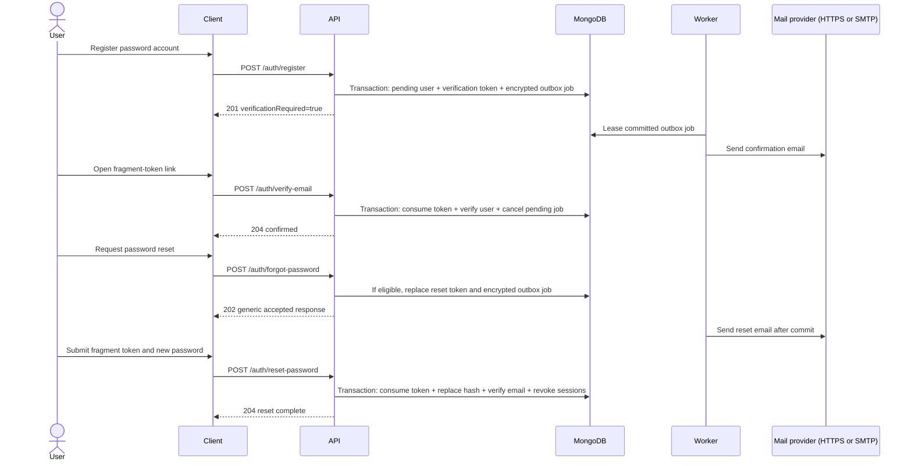

  

Raw tokens are delivered only in URL fragments and request bodies. MongoDB

stores only HMAC token hashes; outbox payloads are AES-256-GCM encrypted. Email

verification links expire after 24 hours and password-reset links after 15

minutes. Resend and forgot-password responses never reveal account existence.