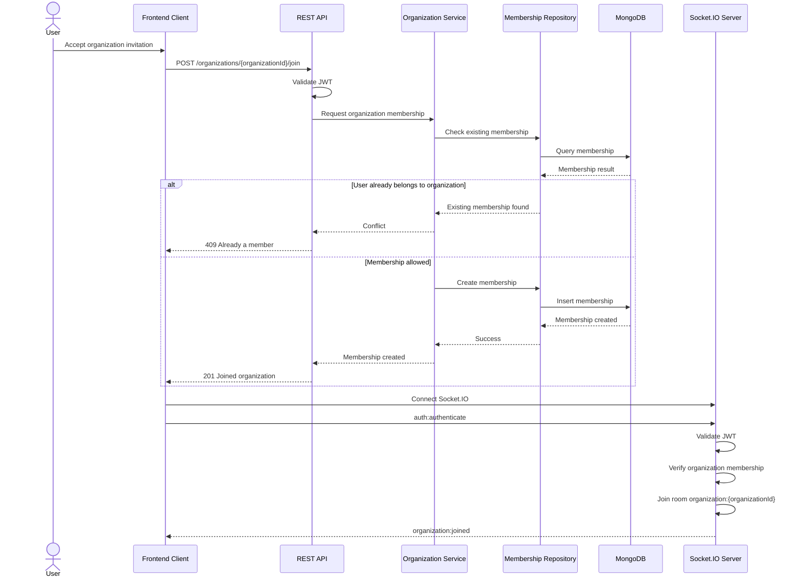

```mermaid
sequenceDiagram

    actor User

    participant Client as Frontend Client
    participant API as REST API
    participant OrgService as Organization Service
    participant MembershipRepo as Membership Repository
    participant DB as MongoDB
    participant Socket as Socket.IO Server

    User->>Client: Accept organization invitation

    Client->>API: POST /organizations/{organizationId}/join

    API->>API: Validate JWT

    API->>OrgService: Request organization membership

    OrgService->>MembershipRepo: Check existing membership

    MembershipRepo->>DB: Query membership

    DB-->>MembershipRepo: Membership result

    alt User already belongs to organization

        MembershipRepo-->>OrgService: Existing membership found

        OrgService-->>API: Conflict

        API-->>Client: 409 Already a member

    else Membership allowed

        OrgService->>MembershipRepo: Create membership

        MembershipRepo->>DB: Insert membership

        DB-->>MembershipRepo: Membership created

        MembershipRepo-->>OrgService: Success

        OrgService-->>API: Membership created

        API-->>Client: 201 Joined organization

    end

    Client->>Socket: Connect Socket.IO

    Client->>Socket: auth:authenticate

    Socket->>Socket: Validate JWT

    Socket->>Socket: Verify organization membership

    Socket->>Socket: Join room organization:{organizationId}

    Socket-->>Client: organization:joined
```