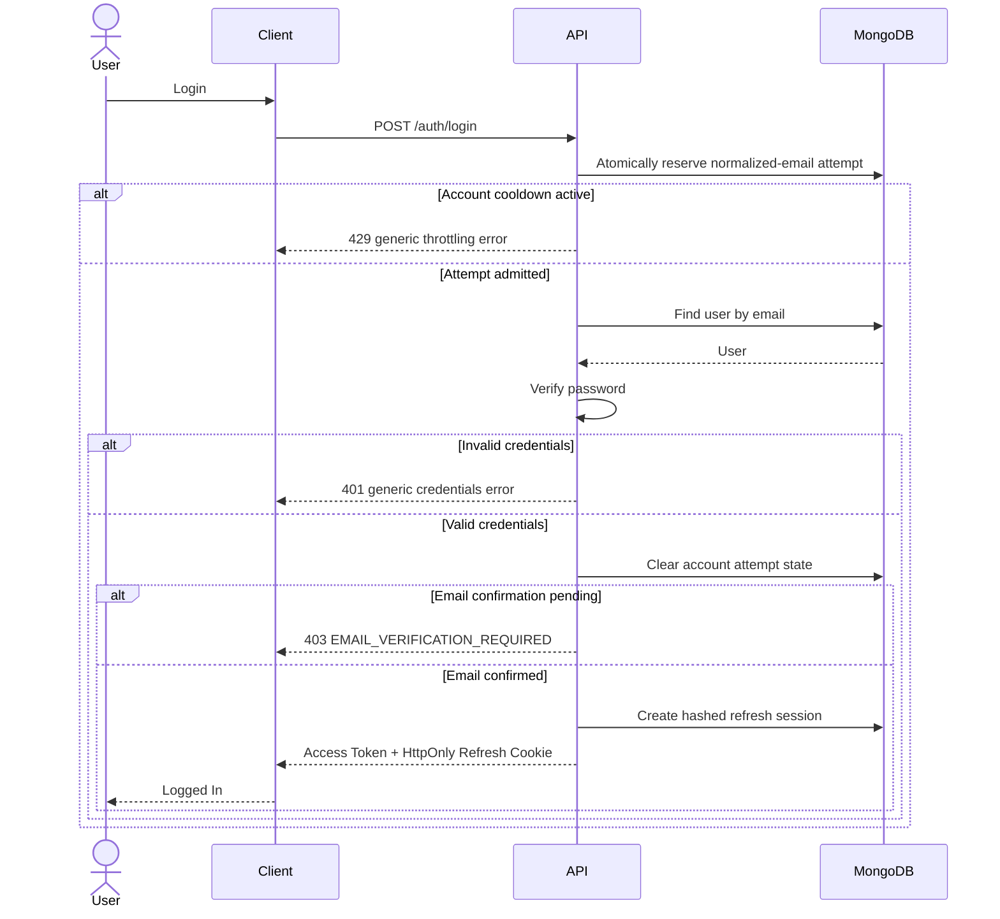

```mermaid

sequenceDiagram

  

    actor User

  

    participant Client

  

    participant API

  

    participant MongoDB

  

    User->>Client: Login

  

    Client->>API: POST /auth/login

  

    API->>MongoDB: Atomically reserve normalized-email attempt

  

    alt Account cooldown active

  

        API-->>Client: 429 generic throttling error

  

    else Attempt admitted

  

    API->>MongoDB: Find user by email

  

    MongoDB-->>API: User

  

    API->>API: Verify password

  

    alt Invalid credentials

  

        API-->>Client: 401 generic credentials error

  

    else Valid credentials

  

    API->>MongoDB: Clear account attempt state

  

    alt Email confirmation pending

  

        API-->>Client: 403 EMAIL_VERIFICATION_REQUIRED

  

    else Email confirmed

  

    API->>MongoDB: Create hashed refresh session

  

    API-->>Client: Access Token + HttpOnly Refresh Cookie

  

    Client-->>User: Logged In

  

    end

  

    end

  

    end

```