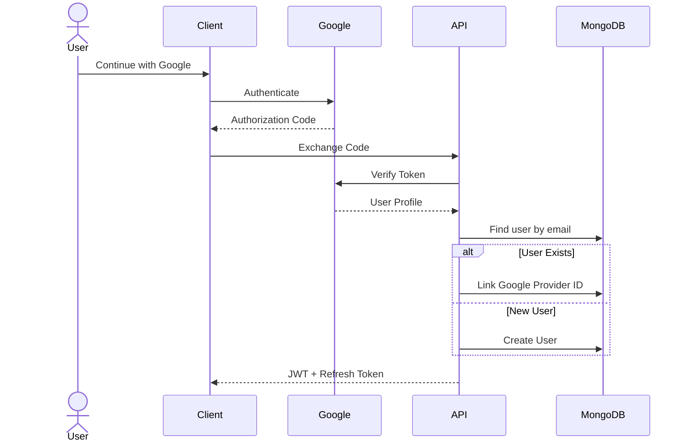

```mermaid
sequenceDiagram

    actor User

    participant Client

    participant Google

    participant API

    participant MongoDB

    User->>Client: Continue with Google

    Client->>Google: Authenticate

    Google-->>Client: Authorization Code

    Client->>API: Exchange Code

    API->>Google: Verify Token

    Google-->>API: User Profile

    API->>MongoDB: Find user by email

    alt User Exists
        API->>MongoDB: Link Google Provider ID
    else New User
        API->>MongoDB: Create User
    end

    API-->>Client: JWT + Refresh Token
```