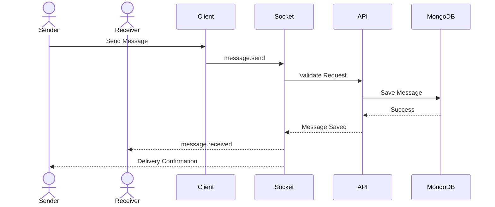

```mermaid
sequenceDiagram

    actor Sender

    actor Receiver

    participant Client

    participant Socket

    participant API

    participant MongoDB

    Sender->>Client: Send Message

    Client->>Socket: message.send

    Socket->>API: Validate Request

    API->>MongoDB: Save Message

    MongoDB-->>API: Success

    API-->>Socket: Message Saved

    Socket-->>Receiver: message.received

    Socket-->>Sender: Delivery Confirmation
```